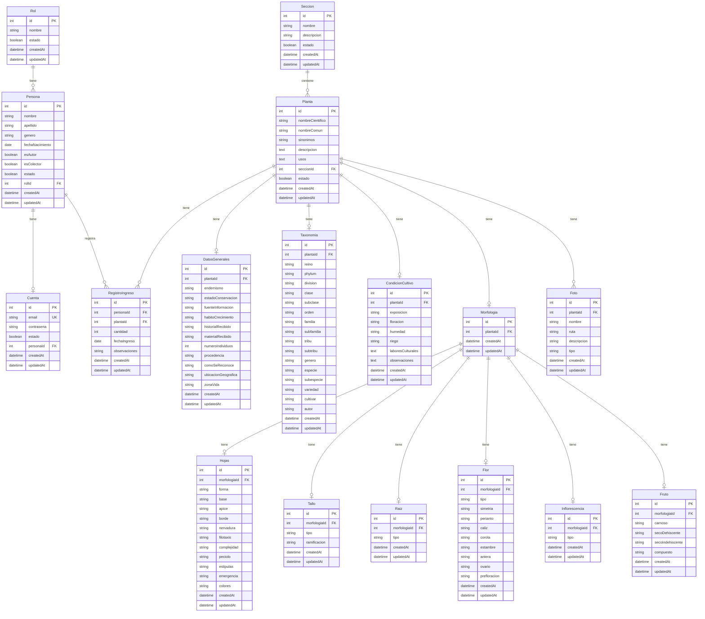

# Diagrama de Clases Corregido - Jardín Botánico

## Cambios realizados respecto al diagrama original

### Nomenclatura
- `historial` → `CondicionCultivo` (describe mejor el propósito)
- `PP` → `RegistroIngreso` (más descriptivo)
- `Inflorescensia` → `Inflorescencia` (corrección ortográfica)
- `Datos generales` → `DatosGenerales` (sin espacios)

### Tipos de datos corregidos
- `Planta.Descripcion`: int → text
- `Hojas.idhojas`: char → int
- `Morfologia.idraiz`: char → int
- `Morfologia.idtallo`: char → int
- `RegistroIngreso.fec_ing`: char → date

### Nuevas tablas
- `Seccion`: Para clasificar plantas por sección del jardín

### Cardinalidades ajustadas
- `Morfologia` → características: 1:1 → 1:0..1 (opcional)

---

## Leyenda de Cardinalidades

| Símbolo | Significado |
|---------|-------------|
| `\|\|--o{` | Uno a muchos (0..*) |
| `\|\|--o\|` | Uno a uno opcional (0..1) |
| `\|\|--\|\|` | Uno a uno obligatorio |

## Notas de Diseño

### 1. Campos de Auditoría
Todas las tablas incluyen `createdAt` y `updatedAt` para trazabilidad.

### 2. Soft Delete
Se utiliza campo `estado` (boolean) en lugar de eliminar registros físicamente.

### 3. Morfología como Agregador
La tabla `Morfologia` actúa como punto de unión para todas las características morfológicas, facilitando:
- Consultas de "toda la morfología" de una planta
- Características opcionales (una planta sin flores no tendrá registro en `Flor`)

### 4. Secciones del Jardín
Nueva tabla `Seccion` para organizar plantas por área (Ornamentales, Medicinales, etc.)

### 5. Registro de Ingresos
Renombrado de `PP` a `RegistroIngreso` para mayor claridad. Registra quién ingresó qué planta y cuándo.
